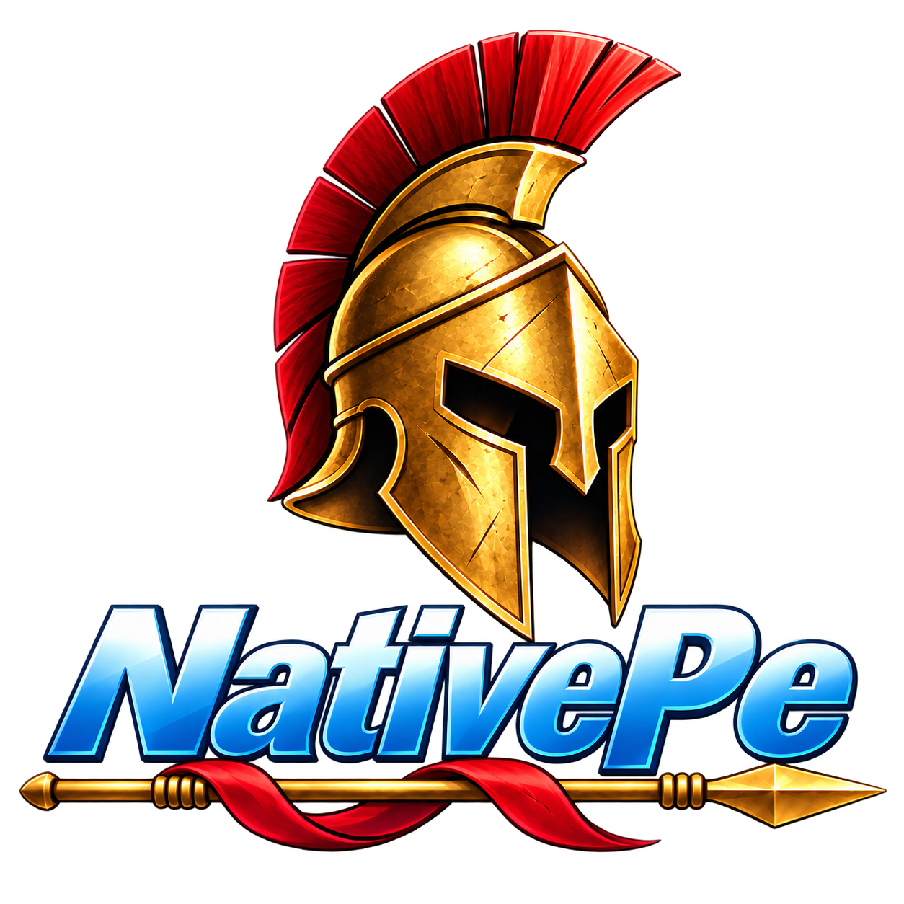

# NativePe

<p align="center">
  
</p>

NativePe is a Windows Portable Executable library written in Object Pascal for Delphi.

The project focuses on PE parsing, mapping, loading, relocation, import and export handling, dumping, process memory reading, and related Windows internals. It supports Win32 and Win64 builds from the same source tree.

NativePe is a research project. It has been tested against a large set of normal, unusual, malformed, and hostile PE files, but it does not claim to handle every possible PE file correctly.

## Motivation

Part of the motivation is personal. I used Delphi around the early 2000s and wanted to revisit low-level Windows development with modern Delphi.

NativePe is also a practical experiment to show that Object Pascal can still be used for PE and Windows internals research.

## Origin and relationship to libpeconv

The NativePe PE-processing core is an Object Pascal port/reimplementation of [libpeconv](https://github.com/hasherezade/libpeconv) by hasherezade.

The code was rewritten in Object Pascal, but the core module split and many public operations, validation paths, control-flow decisions, fallback rules, diagnostics, and tests were derived from the libpeconv source. NativePe is therefore not a clean-room or independently designed implementation of the libpeconv functionality it ports.

The libpeconv revision used by the current differential harness is commit `0fc25f680e03699d33ef3b2034a6724365f3d1a4`.

Thanks to hasherezade for publishing libpeconv. See [docs/PROVENANCE.md](docs/PROVENANCE.md) for the source-level relationship and [THIRD-PARTY-NOTICES.md](THIRD-PARTY-NOTICES.md) for attribution and license notices.

## What's original here

NativePe is more than a syntax translation of libpeconv. The current project adds NativePe-specific functionality and Delphi/Windows integration around the ported core.

This includes API Set resolution, pluggable WinAPI/NTAPI/direct-syscall memory providers, security-cookie initialization, PE recycling helpers, and related integration code. These parts have no direct source-module counterpart in the pinned libpeconv core.

The repository also contains NativePe-specific Delphi test projects, real-world fixtures, corpus tooling, and Windows integration tests.

## Main features

- PE32 and PE32+ header and section handling
- RAW to virtual and virtual to RAW conversion
- Base relocations
- Normal and delay-load import handling
- Export lookup and export mapping
- TLS parsing and callback handling
- Resource directory parsing
- Exception directory handling
- Load Config parsing
- PEB based module lookup
- Manual PE loading
- Remote process PE reading and dumping
- Import reconstruction and repair helpers
- Code cave discovery and PE recycling helpers
- IAT and local function redirection helpers
- Optional API Set resolution
- Optional security cookie initialization
- Pluggable memory access layer
- WinAPI memory backend
- NTAPI memory backend through ntdll
- Win64 direct syscall memory backend
- Win32 and Win64 targets

More details are in [docs/FEATURES.md](docs/FEATURES.md).

## Memory backends

NativePe separates PE logic from selected operating system memory operations through `TNativePeMemoryProvider`.

The current built-in backends are:

- `TWinApiMemoryProvider`
- `TNtApiMemoryProvider`
- `TSyscallMemoryProvider` on Win64

The existing hook path also keeps its optional `UseSyscalls` compatibility switch for direct syscall based memory protection.

See [docs/MEMORY-PROVIDERS.md](docs/MEMORY-PROVIDERS.md).

## Testing

NativePe uses several test layers:

- DUnitX regression and integration tests
- malformed PE tests
- real Windows process and loader tests
- an isolated corpus runner
- libpeconv fidelity and differential checks

The documented differential run from September 25, 2026 processed 30,159 identical corpus paths with NativePe and the pinned libpeconv harness. At outcome level, 30,147 paths matched and 12 differed. NativePe recorded no worker crashes in that run; the libpeconv harness recorded six. These results describe this corpus and these harnesses only and do not establish general superiority.

The run was not a benchmark-quality performance run, so its timing data is not used for performance claims. External corpora and malware samples are not distributed with NativePe.

See [docs/TESTING.md](docs/TESTING.md), [docs/CORPUS-RESULTS.md](docs/CORPUS-RESULTS.md), and [docs/LIBPECONV-COMPARISON.md](docs/LIBPECONV-COMPARISON.md).

## Building

NativePe is developed with Delphi 12 Athens.

Open `NativePe.groupproj` to build the included demo, tests, corpus runner, process dump tool, and real-world test projects.

The main library source is under `src`. Projects can also use NativePe directly by adding `src` to the Delphi unit search path and referencing the required `NativePe.*` units.

Both Win32 and Win64 are supported by the included projects.

## Minimal loader example

The following example maps a PE image, applies relocations, and resolves imports. It does not call the PE entry point.

```delphi
program PeLoaderMinimal;

{$APPTYPE CONSOLE}

uses
  System.SysUtils,
  NativePe.BufferUtil,
  NativePe.PeLoader;

var
  Image: TAlignedBuf;
  ImageSize: NativeUInt;

begin
  if ParamCount <> 1 then
    Halt(1);

  Image := LoadPeExecutable(ParamStr(1), ImageSize);
  if Image = nil then
    Halt(1);
  try
    Writeln('Loaded at: 0x', IntToHex(NativeUInt(Image), SizeOf(Pointer) * 2));
    Writeln('Virtual size: ', ImageSize);
  finally
    FreePeBuffer(Image, ImageSize);
  end;
end.
```

Add `src` to the Delphi unit search path and run the program with a PE file as its only argument.

## Running the tools

The repository contains several executables and helper scripts. The main entry points are documented in [docs/BINARIES.md](docs/BINARIES.md).

Important: `NativePeDemo.exe` loads and executes the supplied PE file. Use it only with trusted test files. The corpus runner is designed for static PE processing and does not intentionally execute PE entry points or TLS callbacks.

## Documentation

- [Documentation index](docs/README.md)
- [Source provenance](docs/PROVENANCE.md)
- [Features](docs/FEATURES.md)
- [Memory providers](docs/MEMORY-PROVIDERS.md)
- [Testing](docs/TESTING.md)
- [Binaries and command line usage](docs/BINARIES.md)
- [Real-world tests](docs/REALWORLD-TESTS.md)
- [Corpus results](docs/CORPUS-RESULTS.md)
- [NativePe and libpeconv comparison](docs/LIBPECONV-COMPARISON.md)
- [Third-party notices](THIRD-PARTY-NOTICES.md)

## Project status

NativePe is actively used as a research and testing project. APIs and implementation details may still change as new PE edge cases are found.

Extensive testing reduces risk, but it is not proof of complete correctness. Treat untrusted PE files as untrusted input and use appropriate isolation when working with malware.

## License

NativePe's original contributions are released under the [MIT License](LICENSE).

Code derived from third-party projects retains the applicable upstream notices and license conditions described in [THIRD-PARTY-NOTICES.md](THIRD-PARTY-NOTICES.md).
